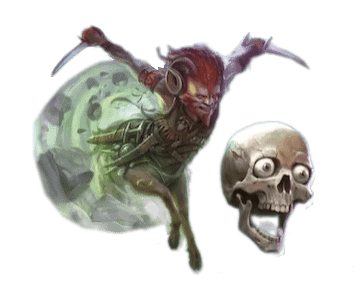

# BG3-MOD-Feat-DnD5-Planescape

[Nexus](https://www.nexusmods.com/baldursgate3/mods/12096) - [mod.io](https://mod.io/g/baldursgate3/m/features-from-dnd-5e-planescape) - [Source](https://github.com/valsan-azerty-boi/BG3-MOD-Feat-DnD5-Planescape)

## Features
This mod implements features from the D&D 5E Planescape sourcebooks into Baldur's Gate 3. These mechanics have been adapted to better match the way the game works. Contains backgrounds, goals, feats, spells, items, etc.

## Languages
- English 
- French
- Russian (by Hecctus)
- Brazilian Portuguese (by AlucardTraducao)

## Requirements
- BG3 *Patch 7*
- ImprovedUI / ImpUI

## Installation
- Install using the [official ig mod manager](https://mod.io/g/baldursgate3/m/features-from-dnd-5e-planescape) or any third-party mod manager

## Special thanks
- CrimsonEdge
- JuuM
- Soulson
- Spooky Syd Meier
- berrako
- Hecctus
- AlucardTraducao
- Fetish
- CFLO
- And Larian for the game and Mod Toolkit

## CC credits
- AD&D2 Lady of Pain mask 3D model from [chrisgo](https://www.thingiverse.com/thing:2407798)
- Planescape Torment Nordom 3D model from [Xavier L.](https://www.myminifactory.com/object/3d-print-nordom-planescape-torment-208680)

